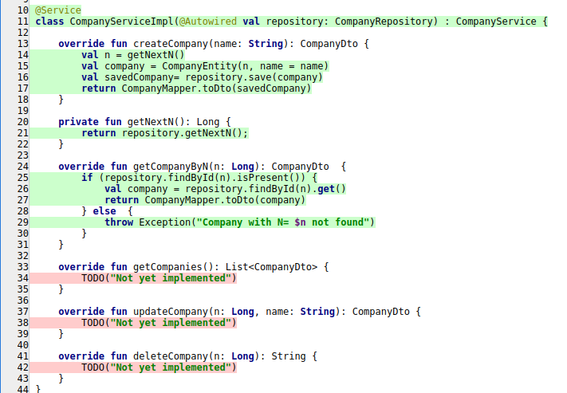

## Простой проект на kotlin и Spring Boot

### Оглавление:
[Цель](#target)<br/>
[Unit тестирование](unit_test)<br/>
[Покрытие тестами](#coverage)<br/>
[Логгирование](#logging)<br/>
[Запуск](#run)<br/>
[Ручное тестирование httpie](#httpie)<br/>
[TODO](#todo)<br/>
[Примечания](#tose)<br/>
[Ссылки](#links)<br/>

<a id="target"></a>
### Цель

Cоздать приложение на <b>Kotlin</b> с использованием <b>Spring Boot</b> для работы с БИЗНЕС-ПРОЦЕССОМ устройства на работу. Для этого д.б. следующие элементы:

__Вакансия__ со следующими свойствами:
<ul>
<li>Название</li>
<li>Компания</li>
<li>Требования</li>
<li>Дата создания</li>
<li>Дата последнего события</li>
<li>Зарплата (если есть)</li>
<li>Источник (ссылка hh.ru, др.ссылки)</li>
<li>Контакты представителя компании (имя, почта, ТГ, ...)</li>
<li>Комментарий</li>
</ul>

__События при трудоустроустве__:
<ul>
<li>Отклик на вакансию</li>
<li>Переговоры, отклики</li>
<li>Планирование встреч</li>
<li>Встречи (переговоры с кадрами, собеседования, ...) и результаты</li>
<li>Обмен документами (отправка в отдел кадров, подписание договора)</li>
<li></li>
</ul>

__Отчеты__:
Текущее состояние ситуации.
???

В качестве базы данных использовать PostgreSQL.

<a id="unit_test"></a>
### Unit тестирование

````java
$ ./gradlew test
````

<a id="coverage"></a>
### Покрытие тестами
В Idea выплнить Run/Show Coverage Data (Ctrl-Alt-6). Отчет:


__или__ с использованием [https://www.jacoco.org/jacoco/](https://www.jacoco.org/jacoco/). (подключен плагин в build.gradle.kts: id("jacoco"))

Создание отчета о покрытии тестами:
````java
$ ./gradlew jacocoTestReport
````

Результат в build/reports/jacoco/test/html/index.html: 


test coverage для класса:


<a id="logging"></a>
### Логгирование

Настройка в application.yaml

````shell
...
logging:
  level:
    root: info
  file:
    path: log/
...
````

Пример из EchoCtrl.kt:

````shell
private val logger = LoggerFactory.getLogger(this.javaClass.name)
...
        logger.info("$counter GET $mes")
...
````

<a id="run"></a>
### Запуск

````shell
./gradlew bootRun
````
<a id="httpie"></a>
### Ручное тестирование httpie

Доступ по :8980/vacancy/api

Тестовый запрос echo:

````java
$ http http://192.168.1.57:8980/vacancy/api/echo/aaa
````
(используется программа httpie)


[Примечания](#tose)<br/>

<a id="todo"></a>
### TODO
Анализ кода Idea Analize<br/>
Анализ кода SonarCube<br/>
<br/>
Unit тестирование<br/>
После отладки JPA, перенести в PostgreSQL на v.perm.ru<br/>
Spring profiles<br/>
Тестовый запуск<br/>
<br/>
Создание запускаемого файла и его запуск<br/>
Publishing SpringBoot "FAT" jar<br/>
<br/>
Интеграционное тестирование<br/>
Примеры тестов httpie<br/>
DataJpa tests<br/>
RestAssured tests<br/>
Нагрузочное тестирование<br/>

Swagger<br/>
Spring Actuator<br/>

Prometheus<br/><br/>
Docker<br/>
Кеширование<br/>
Сборка Jenkins<br/>
Nexus<br/>

<a id="links"></a>
### Ссылки
