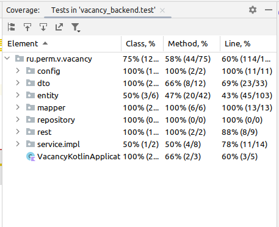

## Простой проект на kotlin и Spring Boot

### Оглавление:
[Цель](#target)<br/>
[Unit тестирование](#unit_test)<br/>
[Интеграционное тестирование работы с БД](#integration_test_database)<br/>
[Покрытие тестами](#coverage)<br/>
[Логгирование](#logging)<br/>
[Запуск](#run)<br/>
[Ручное тестирование httpie](#httpie)<br/>
[Созлание запускаемого файла](#bootJar)<br/>
[Сборка Jenkins](#jenkins)<br/>
[Publishing SpringBoot "FAT" jar](#fat)<br/>

[Анализ кода Idea Analize](#idea_analizer)<br/>
[Интеграционное тестирование RestAssured](#rest_assured_tests)<br/>

[Swagger](#swagger)<br/>
[Spring Actuator](#actuator)<br/>

[TODO](#todo)<br/>
[Примечания](#tose)<br/>
[Просмотр commits в github](#commits_github)<br/>
[Ссылки](#links)<br/>

<a id="target"></a>
### Цель

Cоздать приложение на <b>Kotlin</b> с использованием <b>Spring Boot</b> для работы с БИЗНЕС-ПРОЦЕССОМ устройства на работу. Для этого д.б. следующие элементы:

__Вакансия__ со следующими свойствами:
<ul>
<li>Название</li>
<li>Компания</li>
<li>Требования</li>
<li>Дата создания</li>
<li>Дата последнего события</li>
<li>Зарплата (если есть)</li>
<li>Источник (ссылка hh.ru, др.ссылки)</li>
<li>Контакты представителя компании (имя, почта, ТГ, ...)</li>
<li>Комментарий</li>
</ul>

__События при трудоустроустве__:
<ul>
<li>Отклик на вакансию</li>
<li>Переговоры, отклики</li>
<li>Планирование встреч</li>
<li>Встречи (переговоры с кадрами, собеседования, ...) и результаты</li>
<li>Обмен документами (отправка в отдел кадров, подписание договора)</li>
<li></li>
</ul>

__Отчеты__:
Текущее состояние ситуации.
???

В качестве базы данных использовать PostgreSQL.

<a id="unit_test"></a>
### Unit тестирование

````java
$ ./gradlew test
````

<a id="integration_test_database"></a>
### Интеграционное тестирование работы с БД

````java
$ ./gradlew test --tests '*Integration*'
````


<a id="coverage"></a>
### Покрытие тестами
В Idea выплнить Run/Show Coverage Data (Ctrl-Alt-6). Отчет:


__или__ с использованием [https://www.jacoco.org/jacoco/](https://www.jacoco.org/jacoco/). (подключен плагин в build.gradle.kts: id("jacoco"))

Создание отчета о покрытии тестами:
````java
$ ./gradlew jacocoTestReport
````

Результат в build/reports/jacoco/test/html/index.html: 


test coverage для класса:


<a id="logging"></a>
### Логгирование

Настройка в application.yaml

````shell
...
logging:
  level:
    root: info
  file:
    path: log/
...
````

Пример из EchoCtrl.kt:

````shell
private val logger = LoggerFactory.getLogger(this.javaClass.name)
...
        logger.info("$counter GET $mes")
...
````

<a id="run"></a>
### Запуск

````shell
./gradlew bootRun
````
<a id="httpie"></a>
### Ручное тестирование httpie

Доступ по :8980/vacancy/api

Тестовый запрос echo:

````java
$ http :8980/vacancy/api/vacancy/echo/aaa
````
(используется программа httpie)

<a id="bootJar"></a>
### Создание запускаемого файла и его запуск

````java
$ ./gradlew bootJar
````
Собранный jar будет в build/libs/vacancy_backend-<version>.jar

Запуск:
````java
$ java -jar build/libs/vacancy_backend-<version>.jar
````

Получение jar файла из Nexus через командную строку (или в скрипте для развертывания на сервере):

````shell
$ wget http://192.168.1.20:8082/repository/ru.perm.v/ru/perm/v/vacancy_backend/0.24.0706.1/vacancy_backend-0.24.0706.1.jar
````

или через v.perm.ru:

````shell
$ wget http://v.perm.ru:8082/repository/ru.perm.v/ru/perm/v/vacancy_backend/0.24.0706.1/vacancy_backend-0.24.0706.1.jar
````

<a id="jenkins"></a>
### Сборка Jenkins

Сборка происходит в Jenkins, развернутом на домашнем сервере. Pipeline для Jenkins описан в файле [./Jenkinsfile](Jenkinsfile)

<a id="fat"></a>
###  Publishing SpringBoot "FAT" jar

Настройка:

````yaml
publishing {
  repositories {
      maven {
          url = uri("http://v.perm.ru:8082/repository/ru.perm.v/")
          isAllowInsecureProtocol = true
          //  for publish to nexus "./gradlew publish"
          // export NEXUS_CRED_USR=admin
          // echo $NEXUS_CRED_USR
          credentials {
              username = System.getenv("NEXUS_CRED_USR")
              password = System.getenv("NEXUS_CRED_PSW")
          }
      }
  }
  publications {
    create<MavenPublication>("maven"){
      artifact(tasks["bootJar"]) // build and publish bootJar
    }
}
````

При выполнении ./gradlew publish собранный jar будет опубликован в nexus.

[https://stackoverflow.com/questions/64062905/unable-to-publish-jar-to-gitlab-package-registry-with-gradle](https://stackoverflow.com/questions/64062905/unable-to-publish-jar-to-gitlab-package-registry-with-gradle)

### Publishing source to Nexus

````yaml
val sourcesJar by tasks.registering(Jar::class)  {
  archiveClassifier.set("sources")
    from(sourceSets.main.get().allSource)
}
  
publishing {
  ....
  publications {
    create<MavenPublication>("maven"){
      artifact(tasks["bootJar"])
      artifact(tasks["sourcesJar"])
    }
  }
  ....
}
````

<a id="idea_analizer"></a>
### Анализ кода Idea Analize

В Idea вызывается из Code ->  Inspect Code.

<a id="rest_assured_tests"></a>
### RestAssured tests<br/>

[https://github.com/cherepakhin/vacancy_backend_rest_test](https://github.com/cherepakhin/vacancy_backend_rest_test)

<a id="swagger"></a>
### Swagger

После запуска доступен по адресу [http://127.0.0.1:8980/vacancy/api/swagger-ui/](http://127.0.0.1:8980/vacancy/api/swagger-ui/)


<a id="actuator"></a>
### Spring Actuator

После запуска доступен по адресу [http://127.0.0.1:8988/vacancy/api/actuator](http://127.0.0.1:8988/vacancy/api/actuator)

````java
$ http http://127.0.0.1:8988/vacancy/api/actuator
HTTP/1.1 200 
Connection: keep-alive
Content-Type: application/vnd.spring-boot.actuator.v3+json
Date: Sat, 22 Jun 2024 16:02:17 GMT
Keep-Alive: timeout=60
Transfer-Encoding: chunked

{
    "_links": {
        "beans": {
            "href": "http://127.0.0.1:8988/vacancy/api/actuator/beans",
            "templated": false
        },
        "caches": {
            "href": "http://127.0.0.1:8988/vacancy/api/actuator/caches",
            "templated": false
        },
        "caches-cache": {
            "href": "http://127.0.0.1:8988/vacancy/api/actuator/caches/{cache}",
            "templated": true
        },
        "conditions": {
            "href": "http://127.0.0.1:8988/vacancy/api/actuator/conditions",
            "templated": false
        },
        "configprops": {
            "href": "http://127.0.0.1:8988/vacancy/api/actuator/configprops",
            "templated": false
        },
        "configprops-prefix": {
            "href": "http://127.0.0.1:8988/vacancy/api/actuator/configprops/{prefix}",
            "templated": true
        },
        "env": {
            "href": "http://127.0.0.1:8988/vacancy/api/actuator/env",
            "templated": false
        },
        "env-toMatch": {
            "href": "http://127.0.0.1:8988/vacancy/api/actuator/env/{toMatch}",
            "templated": true
        },
        "health": {
            "href": "http://127.0.0.1:8988/vacancy/api/actuator/health",
            "templated": false
        },
        "health-path": {
            "href": "http://127.0.0.1:8988/vacancy/api/actuator/health/{*path}",
            "templated": true
        },
        "heapdump": {
            "href": "http://127.0.0.1:8988/vacancy/api/actuator/heapdump",
            "templated": false
        },
        "info": {
            "href": "http://127.0.0.1:8988/vacancy/api/actuator/info",
            "templated": false
        },
        "logfile": {
            "href": "http://127.0.0.1:8988/vacancy/api/actuator/logfile",
            "templated": false
        },
        "loggers": {
            "href": "http://127.0.0.1:8988/vacancy/api/actuator/loggers",
            "templated": false
        },
        "loggers-name": {
            "href": "http://127.0.0.1:8988/vacancy/api/actuator/loggers/{name}",
            "templated": true
        },
        "mappings": {
            "href": "http://127.0.0.1:8988/vacancy/api/actuator/mappings",
            "templated": false
        },
        "metrics": {
            "href": "http://127.0.0.1:8988/vacancy/api/actuator/metrics",
            "templated": false
        },
        "metrics-requiredMetricName": {
            "href": "http://127.0.0.1:8988/vacancy/api/actuator/metrics/{requiredMetricName}",
            "templated": true
        },
        "prometheus": {
            "href": "http://127.0.0.1:8988/vacancy/api/actuator/prometheus",
            "templated": false
        },
        "scheduledtasks": {
            "href": "http://127.0.0.1:8988/vacancy/api/actuator/scheduledtasks",
            "templated": false
        },
        "self": {
            "href": "http://127.0.0.1:8988/vacancy/api/actuator",
            "templated": false
        },
        "threaddump": {
            "href": "http://127.0.0.1:8988/vacancy/api/actuator/threaddump",
            "templated": false
        }
    }
}
````

<a id="tose"></a>
### Примечания

Решение проблемы циклических зависимостей Spring. CompanyService зависит от VacancyService, а VacancyService зависит от CompanyServiceImpl. При поднятии сервиса возникнет ошибка. Решение: 

Определение CompanyServiceImpl: 

````java
@Service
class CompanyServiceImpl(val repository: CompanyRepository, @Lazy val vacancyService: VacancyServiceImpl) : CompanyService {...}
````

Определение VacancyServiceImpl:

````java
@Service
class VacancyServiceImpl(
    @Autowired private val repository: VacancyRepository,
    @Autowired private val companyService: CompanyService
) : VacancyService {...}
````

В CompanyService использована аннотация @Lazy для vacancyService. 

#### Что это было?

Изменения в коде не подхватываются при запуске ./gradlew bootRun. Решилось так:

````shell
./gradlew clean
./gradlew build
./gradlew bootRun
````

java -verbose:class <other args> - вывод загруженных классов

<a id="todo"></a>
### TODO
Анализ кода SonarCube<br/>
<br/>
После отладки JPA, перенести в PostgreSQL на v.perm.ru<br/>
Spring profiles<br/>
<br/>
DataJpa tests<br/>
Нагрузочное тестирование<br/>
<br/>
Prometheus<br/><br/>
Docker<br/>
Кеширование<br/>
<br/>
Camel для интеграции<br/>
jxls для отчетов<br/>

<a id="commits_github"></a>
### Просмотр commits в github

[https://github.com/cherepakhin/vacancy_backend_rest_test/commits](https://github.com/cherepakhin/vacancy_backend_rest_test/commits)

<a id="links"></a>
### Ссылки

[https://github.com/cherepakhin/shop_kotlin](https://github.com/cherepakhin/shop_kotlin)
[https://github.com/cherepakhin/shop_kotlin_restassured_test](https://github.com/cherepakhin/shop_kotlin_restassured_test)
[Kotlin + Hibernate: всё сложно](https://habr.com/ru/companies/haulmont/articles/572574/)